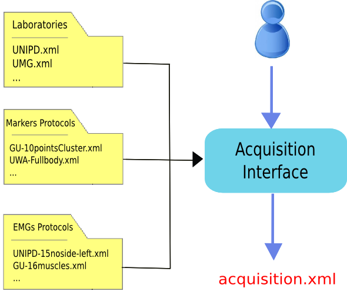
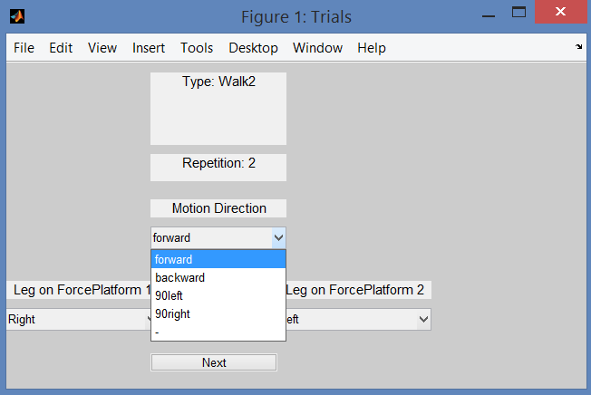
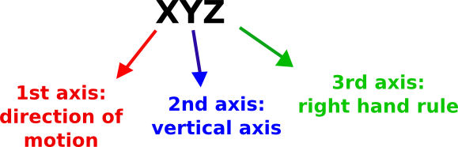
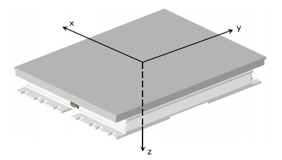
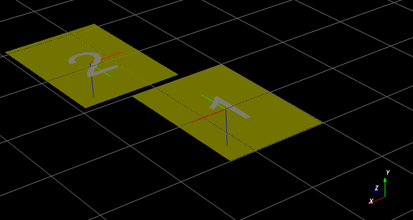
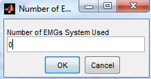

.. _`AcquisitionInterface`:

Acquisition Interface: describing your data
===========================================

During this step, a graphical user interface (GUI) will assist you in the creation of a file describing the acquisition session (``acquisition.xml``). This file must be created and included in the folder with the C3D data before running the next steps (:ref:`Folders: organize your work figure <dataorg>`). Furthermore, ``acquisition.xml`` is helpful when the data are shared among researchers as it allows to easily figure out all the details about the acquisition session.

The procedure is quite simple: you will go through a sequence of questions about the tracked subjects, people that collected the data, marker and EMG protocol, laboratory characteristics, etc.

The only tricky point is about the prefilled *setup files*. Information about the laboratory setup, markers and EMG protocols are usually common to several acquisitions. Therefore, instead of writing again and again the same values for each acquisition, these data are stored in setup files that can be selected from the GUI (:num:`Fig. #acquisition`). Thus, before running the Acquisition Interface you need to have already all the necessary :ref:`setup files <acquisitionSetupFiles>`. A few examples are available in the directories:

+ ``MOtoNMS\SetupFiles\AcquisitionInterface\Laboratories`` (Laboratory Configurations)
+ ``MOtoNMS\SetupFiles\AcquisitionInterface\MarkersProtocols`` (Markers Protocols)
+ ``MOtoNMS\SetupFiles\AcquisitionInterface\EMGsProtocols`` (EMG Protocols).

If you need a setup file not already included in the folders, you can add new setup files following the instruction in the sections ``Setup Files`` of each chapter.

.. _acquisition:

   Acquisition Interface schema. The user uses the Acquisition Interface GUI to create ``acquisition.xml``. Information about Laboratory configuration and Markers and EMG Protocols are stored in prefilled setup files to avoid reentering data common to multiple acquisitions.

How to run the program
----------------------

#. Set MATLAB path to ``src\AcquisitionInterface`` folder
#. Run ``mainAcquisitionInterface.m`` (this calls ``AcquisitionInterface.m``, the core program)
#. Answer to questions with the required information

**Output**: ``acquisition.xml`` file (saved in the ``InputData`` folder, :ref:`Folders: organize your work figure <dataorg>` - red).

At the beginning, the graphical interface asks whether the user wants to reload an ``acquisition.xml`` file. This is a useful functionality when the user wants to start with information stored in a file already available.

The resulting XML file is considered perfectly valid only when all the information is included (:ref:`Appendix B: Validation of Setup and Configuration Files <AppendixB>`). However, ``mainAcquisitionInterface.m`` only requires the data which are mandatory for the following processing, allowing to skip some answers.

Please pay ATTENTION to the following IMPORTANT NOTES:

.. warning::

   + Input files folder MUST include the ``acquisition.xml`` file before running :ref:`Data Processing <DataProcessing>` and :ref:`Static Elaboration <StaticElaboration>` steps.
   + The ``acquisition.xml`` file is NOT required for :ref:`C3D2MAT <C3D2MAT>`, so you can run :ref:`Acquisition Interface <AcquisitionInterface>` and :ref:`C3D2MAT <C3D2MAT>` in any order.
   + Trials must be named as: *trial type* (``walking, running, fastwalking``,     etc.) + *sequential number*. Examples: ``walking1, fastwalking5``, etc.
   + The sequential number MUST not include any 0 in the front (write 1 not 001), otherwise errors may occur in the processing.
   + Trial names in the ``acquisition.xml`` MUST correspond to the actual input file names.
   + Motion direction refers to the trial and is asked in the GUI (:num:`Fig. #trialgui`). Default value is ``forward``, which means that your subject is moving according to the positive direction of the laboratory coordinate system (CS). If this is not the case, you can choose among the following additional options: ``backward``, ``90left``, ``90right``. All of them are defined with respect to the positive direction of your laboratory CS. If your data do not fit in any of the available choices, please select the remaining option (``-``, i.e. *unconventional* in the ``acquisition.xml`` file). In this case, no extra rotations will be applied to your data: they will be projected in the OpenSim CS preserving the orientation they have in the laboratory CS. For static trials, please indicate the direction your subject is looking towards.
   + If your force platforms include a plate pad on the surface, you can define the thickness of each pad in the laboratory setup file (:ref:`Laboratory <lab>`). Addition of the ``PadThickness`` tag in the file is allowed but not mandatory (:ref:`Plate Padding <platePadding>`). However, please note that if you add it for one force platform, you MUST do the same for ALL the other force platforms defined in the same XML, even if the pad is not present. In this case, you can set the pad thickness to 0.

.. _trialgui:

   
   Acquisition Interface: how to set the motion direction for each trial. This step of the GUI will ask you the leg that strikes on each force platform, and the direction of motion for each of your input data file. This information allows to support trials with different motion directions. Indeed, extra rotations can be required to align data with the positive direction of OpenSim coordinate system (CS).
   

.. _`acquisitionSetupFiles`:

Setup Files
-----------

The following files speed up the process of compiling the ``acquisition.xml`` file that describes your acquisition session. When MOtoNMS has been already used in your laboratory to collect data with EMG and marker protocols do not go further: someone else should have already created these files. If you are not lucky and you have to write your own setup files, do not be scared: it is a simple procedure if you follow carefully the description in this section.
Additionally, once you are done, you can check that the final XML file respect the required syntax with the validation procedure (see :ref:`Appendix B: Validation of Setup and Configuration Files <AppendixB>`).

.. _`lab`:

Laboratory
~~~~~~~~~~
This XML setup file describes the characteristics of the laboratory where data are collected. It has been introduced to avoid re-entering same data for each acquisition carried on in the same laboratory. Its name should uniquely identify the laboratory to whom it refers. Therefore, the best choice is to use a combination of laboratory name, department, university.

The following is an example of an XML setup file with information about the laboratory (available at ``SetupFiles\AcquisitionInterface\Laboratories\UNIPD.xml``).

.. highlight:: xml
   :linenothreshold: 5

.. code-block:: xml
   :linenos:

   <Laboratory xmlns:xsi="http://www.w3.org/2001/XMLSchema-instance">
     <Name>UNIPD</Name>
     <MotionCaptureSystem>BTS</MotionCaptureSystem>
     <CoordinateSystemOrientation>ZYX</CoordinateSystemOrientation>
     <NumberOfForcePlatforms>2</NumberOfForcePlatforms>
     <ForcePlatformsList>
       <ForcePlatform>
         <ID>1</ID>
         <Brand>Bertec</Brand>
         <Type>1</Type>
         <FrameRate>960</FrameRate>
         <FPtoGlobalRotations>
           <Rot>
             <Axis>X</Axis>
             <Degrees>-90</Degrees>
           </Rot>
         </FPtoGlobalRotations>
       </ForcePlatform>
       <ForcePlatform>
         <ID>2</ID>
         <Brand>Bertec</Brand>
         <Type>1</Type>
         <FrameRate>960</FrameRate>
         <FPtoGlobalRotations>
           <Rot>
             <Axis>X</Axis>
             <Degrees>-90</Degrees>
           </Rot>
           <Rot>
             <Axis>Y</Axis>
             <Degrees>180</Degrees>
           </Rot>
         </FPtoGlobalRotations>
       </ForcePlatform>
     </ForcePlatformsList>
   </Laboratory>

The file MUST include:

#. **Orientation of the coordinate system** (``<CoordinateSystemOrientation>`` tag, line 4)

The coordinate system orientation refers to the global or laboratory coordinate system. We used the following convention:

+ 1st axis: direction of motion
+ 2nd axis: vertical axis
+ 3rd axis: right hand rule

with the assumption that the 1st axis has the same verse of OpenSim 1st axis, i.e. it should be the positive direction of motion (:num:`Fig. #convention`).
This convention requires that for any combination of the three axes (e.g. YZX, XZY, YXZ, etc...), the first axis must always be the direction of motion in your lab, the second one your vertical axis, and the last the one results from the right hand rule (:num:`Fig. #convention`). The adopted convention follows ISB recommendation [1]_. Line 4 shows an example of definition of coordinate system orientation.

.. _convention:

   Convention for Coordinate System Orientation: example of interpretation.

2. **Type of force platforms** (``<Type>`` tag, lines 10 and 22)

Force platform (FP) type must be indicated because it influences output data (refer to `The C3D File Format User Guide <http://www.projects.science.uu.nl/umpm/c3dformat_ug.pdf>`_, by Motion Lab Systems, pag. 88 and to your force platform manual).

MOtoNMS recognizes and processes data from force platforms of type 1, 2, 3, and 4. Each plaform returns different data as shown in the following:

+ type 1: [Fx Fy Fz Px Py Mz]

+ type 2 and 4: [Fx Fy Fz Mx My Mz]

+ type 3: [Fx12 Fx34 Fy14 Fy23 Fz1 Fz2 Fz3 Fz4]

where F are the measured reaction forces, M the moments, and P the center of pressure (CoP) along the three directions. Numbers in type 3 platform refers to the sensors (refer to the `C3D File Format User Guide <http://www.projects.science.uu.nl/umpm/c3dformat_ug.pdf>`_ for additional information).

MOtoNMS can process data from several FPs of different type at the same time (i.e. FPs in your laboratory can be of different types). However, there is a single exception: if you have a FP of type 1, all FP in your laboratory should be of type 1. If this is not the case (i.e. you have at least one FP of type 1 and at least another of a different type), please contact the authors for more information on how to proceed.

3. **Rotation between the force platform and the global coordinates** (``<FPtoGlobalRotations>`` tag,  lines 12-17 and 24-33)

It is well known that each FP has its own coordinate system (:num:`Fig. #bertec`) and that C3D files store FP data in the corresponding FP coordinate system. Therefore,  the configuration file about the laboratory must provide also the transformation to rotate each FP reference system to the global one (lines 12-17 and 24-33).

.. _bertec:

   Bertec Plate Coordinate System (from Bertec Force Plates Manual, version 1.0.0, March 2012, `<http://bertec.com/uploads/pdfs/manuals/Force%20Plate%20Manual.pdf>`_).

The XML example shows how to configure two Bertec force platforms. Their relative position and coordinate systems is shown in :num:`Fig. #orientation`.  Lines 12-17 (FP 1) and 24-33 (FP 2) list the required rotations. When more than one rotation is required, they are listed in sequence and estimated around moving axes (lines 24-33).

.. _orientation:

   FP and global coordinate systems orientation of UNIPD Laboratory.

.. _`platePadding`:

Plate Padding
"""""""""""""
 
An additional entry, ``PadThickness`` (line 6), may be included in the laboratory XML file, when data are collected with pads on the surface of FPs. This will allow to correct the computation of CoP coordinates accordingly (please refer to `<http://www.kwon3d.com/theory/grf/pad.html>`_ for additional information). Pad thickness value must be provided in the same unit of length of plate moments. 

The following is an example of definition of a force platform including a pad of 7.5mm, in the laboratory XML file.

.. _padth:

.. highlight:: xml
   :linenothreshold: 5

.. code-block:: xml
   :linenos:
   
   <ForcePlatform>
        <ID>1</ID>
        <Brand>Bertec</Brand>
        <Type>1</Type>
        <FrameRate>960</FrameRate>
	<PadThickness>7.5</PadThickness>
        <FPtoGlobalRotations>
          <Rot>
            <Axis>X</Axis>
            <Degrees>-90</Degrees>
          </Rot>
        </FPtoGlobalRotations>
   </ForcePlatform>
	
   Addition of PadThickness tag in the laboratory XML file.
   
Please, note that if you add the pad thickness to one force platform, you need to do the same for all the other force platforms defined in the same XML setup file, even if the pad is not present. In this case, you can set the value to 0.

Markers Protocols
~~~~~~~~~~~~~~~~~

Each marker protocol must be defined in a separate XML file. In the following an example of an XML  file with information about marker protocols  (available at ``SetupFiles\AcquisitionInterface\MarkersProtocols\UWA-Fullbody.xml``)

.. _markersxml:

.. highlight:: xml
   :linenothreshold: 5

.. code-block:: xml
   :linenos:

   <MarkersProtocol>
     <Name>UWA-Fullbody</Name>
     <MarkersSetStaticTrials>LASI RASI LPSI RPSI ... </MarkersSetStaticTrials>
     <MarkersSetDynamicTrials>C7 RACR LPSI RPSH  ... </MarkersSetDynamicTrials>
   </MarkersProtocol>

In the example the markers set for both Static (``<MarkersSetStaticTrials>`` tag, line 3) and Dynamic Trials (``<MarkersSetDynamicTrials>`` tag, line 4) are defined. Names of the markers must match the labels used to identify the markers in the C3D files.

The labels of the markers cannot include spaces as this would prevent the creation of this configuration file.

.. _`emgsProtocols`:

EMGs Protocols
~~~~~~~~~~~~~~

EMG protocol must be defined in an XML file. An example (available at ``SetupFiles\AcquisitionInterface\EMGsProtocols\UNIPD-15noside-left.xml``) is shown in the following:

.. _emgprotocolxml:

.. highlight:: xml
   :linenothreshold: 5

.. code-block:: xml
   :linenos:

   <EMGsProtocol>
     <Name>UNIPD-15noside-left</Name>
     <MuscleList>
       <Muscle>Gluteus maximus</Muscle>
       <Muscle>Gluteus medius</Muscle>
       <Muscle>Tensor fasciae latae</Muscle>
       <Muscle>Sartorius</Muscle>
       .....
     </MuscleList>
     <InstrumentedLeg>Left</InstrumentedLeg>
   </EMGsProtocol>

The XML file includes information about the name of the protocol (line 2), the list of the muscles (lines 3-9) and the instrumented leg (line 10).
Muscles names (lines 4-8) MUST be those assigned during the acquisition session and, therefore, must agree with labels in the C3D files.

When EMG data are collected, the XML file must define the instrumented leg.  Depending on the leg with EMG sensors its value will be ``Right, Left, Both, None``. These are the only acceptable strings. When EMG signals are not collected during the acquisition session, this configuration file is not required, and the user just sets at 0 the number of EMG systems on the Acquisition Interface GUI (:num:`Fig. #emginterface`).

.. _emginterface:

   Acquisition Interface: how to set the Number of EMGs System used during the acquisition.

.. [1] Ge Wu and Peter R. Cavanagh, ISB Recommendation for standardization of kinematic data in the reporting, Vol. 28 No. 10. pp. 1257-1261,1995
