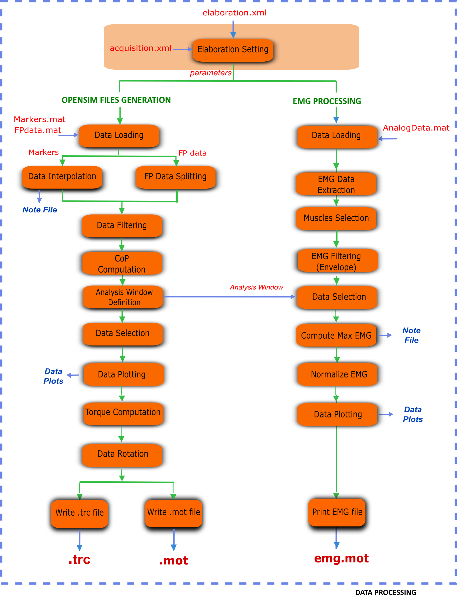
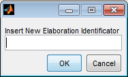

.. _`DataProcessing`:

Data Processing: elaborate your dynamic trials
==============================================

Starting from motion data stored as MATLAB structures by :ref:`C3D2MAT <C3D2MAT>`, Data Processing (:num:`Fig. #flowchart`) produces ``.trc`` and ``.mot`` files for OpenSim, storing respectively markers and forces information. When collected, it also processes EMG signals. Data Processing is only responsible for handling dynamic trials, static trials are managed by :ref:`Static Elaboration <StaticElaboration>`.

Markers and Ground Reaction Forces Elaboration
----------------------------------------------

This section provides a description of the elaboration steps for marker trajectories and ground reaction forces (:num:`Fig. #flowchart` - left column).

At first, markers trajectories undergo piecewise cubic interpolation to fill possible gaps; a text file (``InterpolationNote.txt``) with information about the procedure is also saved. Interpolation is executed in the range between the first and last frames where marker occurs, while the values outside this range are set to zero.
The FP Data Splitting step (:num:`Fig. #flowchart`) handles GRF data generated by the most common force plate types (refer to `The C3D File Format User Guide <http://www.projects.science.uu.nl/umpm/c3dformat_ug.pdf>`_) with different procedure depending on the FP type and its output. Then, the pre-processed marker data and raw GRFs are filtered with a zero-lag second order low pass Butterworth filter at customizable cut-off frequencies (:ref:`Elaboration Interface: configure your elaboration <ElaborationInterfaceConfig>`). When not available from FP data, the centers of pressure are computed exploiting the filtered GRFs. 
The analysis window definition sub-block (:num:`Fig. #flowchart`) selects the portion of the data to be processed. Different methods are available and described in a dedicated section (`Analysis Window Definition <analysisWindDef>`_). At this step, plots of the computed values (i.e., raw EMG, envelopes, and raw and filtered forces, CoP, and moments) are stored for offline visual inspection.
Processed GRFs are used to compute free torques based on filtered forces, moments and CoP for the selected frames.
Finally, marker and GRF data are projected from laboratory or FP reference system to the global reference system of the selected musculoskeletal application, i.e. OpenSim. Required rotations depend on the laboratory setup described in the laboratory setup file (:ref:`Laboratory <lab>`).

.. _flowchart:

   Flowchart of steps in the Data Processing part.

EMG Processing
--------------

When available, EMG signals are also processed for EMG-driven neuromusculoskeletal applications. Currently, MOtoNMS supports CEINMS input file formats (`<https://simtk.org/home/ceinms>`_), but the results can be easily adapted to other applications.

A subset of all the acquired muscles can be selected. Maximum value for each EMG signal is estimated from one or more trials defined by the user: when available, a trial of maximal voluntary isometric contraction can be used, as well as a subset of the input trials. A text file (``maxemg.txt``) logs information about this step (maximum EMGs value and the corresponding trial and time for each of them).
Envelopes for the EMGs are computed and then normalized with their estimated maximum value. Obtained normalized envelopes are stored by default as a ``.mot`` (SIMM and OpenSim motion) file (``emg.mot``) with output labels that can be defined by the user (for details refer to :ref:`Setup Files <DataProcessingSetupFiles>` in this chapter). Plain text and ``.sto`` (OpenSim storage) file formats are also available for logging the results of EMG processing.

.. _`ElaborationInterfaceConfig`:

Elaboration Interface: configure your elaboration
-------------------------------------------------

The execution of Data Processing block is univocally defined by a set of parameters selected by the user. All these parameters are saved in the ``elaboration.xml`` configuration file, which guarantees the high configurability and the fully reproducibility of the toolbox behavior.

The following listing shows an example of an ``elaboration.xml`` configuration file.

.. _elaborationxml:

.. highlight:: xml
   :linenothreshold: 5

.. code-block:: xml
   :linenos:

   <?xml version="1.0" encoding="utf-8"?>
   <elaboration>
   <FolderName>.\InputData\UNIPDsubject\2014-06-09</FolderName>

   <Trials>Walking1 Walking2 FastWalking1 FastWalking2 Running1</Trials>
   
   <MarkersInterpolation>
      <MaxGapSize>15</MaxGapSize>
   </MarkersInterpolation>

   <Filtering>

     <Trial>
     <Name>Walking</Name>
     <Fcut>
       <Markers>8</Markers>
       <Forces>8</Forces>
       <CenterOfPressure>7</CenterOfPressure>
     </Fcut>
     </Trial>

     <Trial>
     <Name>FastWalking</Name>
     <Fcut>
       <Markers>10</Markers>
       <Forces>10</Forces>
       <CenterOfPressure>7</CenterOfPressure>
     </Fcut>
     </Trial>
     ....

   </Filtering>

   <WindowSelectionProcedure>
     <StanceOnFPfromC3D>
       <Leg>Right</Leg>
       <LabelForHeelStrike>Foot Strike</LabelForHeelStrike>
       <LabelForToeOff>Foot Off</LabelForToeOff>
       <Offset>20</Offset>
     </StanceOnFPfromC3D>
   </WindowSelectionProcedure>

   <Markers>C7 RA LA L5 RPSIS LPSIS RASIS LASIS RGT LGT RLE ...</Markers>

   <EMGMaxTrials>FastWalking1 Running1 MVCadd MVCper</EMGMaxTrials>

   <EMGsSelection>
     <EMGSet>UNIPD15nosideL-CEINMS</EMGSet>
     <EMGs>
       <EMG>
         <OutputLabel>bicfemlh_l</OutputLabel>
         <C3DLabel>Biceps femoris caput longus</C3DLabel>
       </EMG>
       ...
     </EMGs>
   </EMGsSelection>

   <EMGOffset>0.2</EMGOffset>

   <OutputFileFormats>
     <MarkerTrajectories>.trc</MarkerTrajectories>
     <GRF>.mot</GRF>
     <EMG>.sto</EMG>
   </OutputFileFormats>

   </elaboration>

This configuration file can be obtained running a user-friendly graphical interface (GUI). The first thing the GUI will ask is to select the input data folder and next to enter an identificator for the current elaboration (:num:`Fig. #elabid`). The identificator will be used to name a new folder in ``ElaboratedData`` storing the results of this elaboration (e.g., ``elaboration01ID`` and ``elaboration02ID`` in :ref:`Folders: organize your work figure <dataorg>`).

.. _elabId:

   Elaboration Interface: setting the Elaboration Identificator

Then, the GUI will ask the parameters required for the elaboration:

+ Trials to be processed: a subset of the C3D files in the input folder

+ Cutoff frequency for markers filtering specified for each trial type (walking, running,...) (Optional)

+ Cutoff frequency for force filtering specified for each trial type (walking, running,..) (Optional)

+ Cutoff frequency for CoP filtering depending on FP type (Optional)

+ Analysis Window Computation method, with its own parameters (offset, C3D events labels, frames for the manual method). Available methods are further described in a dedicated section (`Analysis Window Definition <analysisWindDef>`_)

+ List of markersto be written in ``.trc`` file

When EMG data are available:

+ Trials for the computation of the maximum value of EMG signals

+ Muscles to be considered in the processing (a subset of the acquired EMGs)

+ EMG output labels. Different application names EMG signals differently. To avoid typing output labels several times, translation between EMG protocol labels (in C3D files) and application labels is stored in a setup file (see `EMGs Labels <EMGlabels>`_) that can be selected  from the GUI.

Besides, there are also a few additional parameters that can be set for each elaboration. As their default values usually accomplish a wide range of applications and needs, they are automatically assigned when running the GUI, so the user is not asked to input them each time. 
However, if necessary, they can be manually modified directly in the ``elaboration.xml`` configuration file, once it has been created with the GUI and before running the elaboration.
These parameters are:

+ ``MaxGapSize``  (line 7-9)

  Marker trajectories are piecewise interpolated and each gap is considered for interpolation only if its size is smaller than the maximum gap size allowed (i.e., ``MaxGapSize``).  Otherwise, interpolation for that gap is not performed and a message is printed on the MATLAB Command Window. 
  The ``MaxGapSize`` parameter is assigned according to the Video Frame Rate of your data. Default value is fixed to 15 frames at 60Hz [2]_: the corresponding value for a different frame rate is computed and set.
  You can try different values for this parameter and check how it affects the interpolation process looking at the ``InterpolationNote.txt`` file.
  
+ ``EMGOffset`` (line 58)

  MOtoNMS stores the EMG values starting ``EMGOffset`` second before the initial frame. While MOtoNMS has not been designed to synchronize markers, ground reaction forces and EMGs, it accounts for the need of follow-up applications to deal with the electromechanical delay of muscles providing EMG data from an anterior offset in time. Default value is set to :math:`0.2` seconds. This setting does not allow to define analysis windows starting at the first frame. If you do not need to consider the electromechanical delay in your research, you can manually set ``EMGOffset`` to 0 in your ``elaboration.xml`` file. This also enables the elaboration of data from the first frame.

+ ``OutputFileFormats`` (line 60-64).

  Starting from version 2.1, MOtoNMS allows also the definition of file formats for all the output (i.e. marker trajectories, GRF and EMG) within the ``elaboration.xml`` configuration file (lines 60-64).
  MOtoNMS currently supports a single choice for marker trajectories and GRF, i.e. ``.trc`` and ``.mot`` respectively, which are also the default formats. Nevertheless, the possibility to manage output file formats in the configuration file is a first step toward a future extension of available file formats.
  Conversely, EMG can already be stored differently according to user preference. Current available file formats are: ``.mot`` (SIMM and OpenSim motion, set as default), ``.sto`` (OpenSim storage), and plain text file (``emg.txt``).
  

.. [2] <http://biomch-l.isbweb.org/threads/4734-Summary-Missing-Markers?highlight=markers+interpolation>

.. _`analysisWindDef`:

Analysis Window Definition
--------------------------

Different methods to define the analysis window are available. If events are stored in C3D files, they may be selected as start and end frames of the analysis, otherwise desired frames can be inserted manually. An automatic detection of gait events is also possible based on a thresholding algorithm based on force plate data [3]_ . The following explains the available methods with additional details.

**ComputeStancePhase**: automatic detection of stance phase using a thresholding algorithm based on force plate data. This method needs only to know the leg of the stance. When only one leg is instrumented (see :ref:`EMGs Protocols <emgsProtocols>`), this information can be automatically obtained from the ``acquisition.xml`` file. When both legs are instrumented, the user is asked to indicate the leg he/she wants to consider. Once that the leg is defined, the stance phase is selected based on force data from the FP struck by this leg (line 3 in the following listing). It is also possible to add an offset to the stance phase such that the analysis window will start offset frames before the heel strike and end offset frames after the toe off (line 2).

.. highlight:: xml
   :linenothreshold: 3

.. code-block:: xml
   :linenos:

   <ComputeStancePhase>
     <Offset>20</Offset>
     <Leg>Right</Leg>
   </ComputeStancePhase>

   Example of ComputeStancePhase tag in an elaboration.xml file

**StanceOnFPfromC3D**:method for the selection of analysis window based on events stored in C3D files. It looks for the windows defined by the selected events and chooses the one when the instrumented leg struck the force plate.

Events must be specified by the user and correspond to the label used in the C3D files (:ref:`Elaboration Interface: configure your elaboration <ElaborationInterfaceConfig>`).
Instrumented leg can be selected from the EMG protocol (:ref:`EMGs Protocols <emgsProtocols>`, line 11 in the following listing) or defined by the user when both limbs are instrumented.

Events must precisely define the stance window: MOtoNMS checks force platform values to ensure the validity of the events on the C3D files and errors may be raised. Finally, this method allows to add an offset to the selected events to consider a wider analysis window (line 5).

.. highlight:: xml
   :linenothreshold: 3

.. code-block:: xml
   :linenos:

   <StanceOnFPfromC3D>
     <Leg>Right</Leg>
     <LabelForHeelStrike>Foot Strike</LabelForHeelStrike>
     <LabelForToeOff>Foot Off</LabelForToeOff>
     <Offset>5</Offset>
   </StanceOnFPfromC3D>

   Example of StanceOnFPfromC3D tag in an elaboration.xml file

**WindowFromC3D**: this method allows to select any kind of events stored in the C3D files. It differs from the previous one since it does not focus on specific gait events such as foot strike or foot off. Thus, force data and the instrumented leg are not checked during the elaboration.

The identification of the right event in the C3D files requires that different labels are used for the automatic selection of events. The user is asked to state the full labels (i.e., the ``Context``, which might be ``Right, Left, or General``, + ``Label``) associated to the start and stop events he/she wants to select for the Analysis Window (lines 2-3 in the following listing). ``Offset`` can also be applied to this method (line 4).

.. highlight:: xml
   :linenothreshold: 3

.. code-block:: xml
   :linenos:

   <WindowFromC3D>
     <FullLabelForStartEvent>Right Foot Strike</FullLabelForStartEvent>
     <FullLabelForStopEvent>Right Foot Off</FullLabelForStopEvent>
     <Offset>0</Offset>
   </WindowFromC3D>

   Example of WindowFromC3D tag in an elaboration.xml file

**Manual**: a manual definition of frames to be considered for the elaboration has been implemented as well. It requires to specify start and end frame for each trial (lines 4-5 in the following listing). This gives the user the full freedom in the choice of the analysis window, but it has the drawback to be quite long and complex in the compilation of the ``elaboration.xml`` file, especially in the case of several trials, as start and end frame must be defined for each one.

.. highlight:: xml
   :linenothreshold: 3

.. code-block:: xml
   :linenos:

   <Manual>
     <TrialWindow>
       <TrialName>Walking1</TrialName>
       <StartFrame>133</StartFrame>
       <EndFrame>196</EndFrame>
     </TrialWindow>
     ...

   </Manual>

   Example of Manual tag in an elaboration.xmlfile

.. [3] Rueterbories J et al., Medical Engineering & Physics 32: 545-552,2010

How to run the program
----------------------

Create settings file for elaboration (Elaboration Interface)
~~~~~~~~~~~~~~~~~~~~~~~~~~~~~~~~~~~~~~~~~~~~~~~~~~~~~~~~~~~~

#. Set MATLAB path on ``src\DataProcessingfolder``
#. Run ``ElaborationInterface.m``

**Output**: it generates ``elaboration.xml`` file, which will be saved in the elaboration folder. It also asks if the user wants to run the data processing code using parameters from the ``elaboration.xml`` file just created.

Run processing
~~~~~~~~~~~~~~

If you already have the XML configuration file, you can skip the execution of the Elaboration Interface and run directly the code through the command:

``runDataProcessing(ElaborationFilePath)``

where ``ElaborationFilePath`` is the path of the folder where the ``elaboration.xml`` file you want to run is located.

**Example**

``runDataProcessing(C:\MOtoNMSv10\TestData\ElaboratedData\GUsubject\date
\testRightStanceFromC3D)``

**Output**:``.trc``, ``.mot``, and ``emg.mot|.sto|.txt`` for each trial

Additional files are also created for further possible analysis:

+ ``InterpolationNote.txt`` information about the marker interpolation step;

+ filtered data within the analysis window and the analysis window frames in ``.mat`` format;

+ Plot comparing raw and filtered force plate data within the analysis window;

+ Plot of EMG raw;

+ Plot of EMG envelopes within the analysis window for each muscle;

+ ``AllNormalizedEnvelopes.fig``: plot of normalized EMG linear envelopes of all the muscles;

+ EMG selected for the elaboration: raw (``EMGs/Raw/EMGsSelectedRaw.mat``), linear EMG envelopes before (``EMGs/Envelope/EMGsSelectedEnvelope.mat``) and after normalization (``EMGs/Envelope/emg.mat``), in mat format;

+ ``maxemg/maxemg.txt`` and ``maxemg/maxemg.mat``, storing the maximum EMG value for each muscle, together with the trial and time in which they occur;

+ EMG selected for the maximum EMG values computation: raw (``maxemg/EMGsRawForMax.mat``) and the corresponding linear envelopes (``maxemg/EMGsEnvelopeForMax.mat``);

+ Plot of raw EMG, envelope and maximum EMG value for each muscle, corresponding to the trial where the maximum EMG value occurs. 

Please pay ATTENTION to the following IMPORTANT NOTES:

.. warning::

   + C3D files MUST be converted in mat format before the execution of Data Processing (:ref:`C3D2MAT <C3D2MAT>`).

   + Input data folder requires an ``acquisition.xml`` file. This can be generated with ``mainAquisitionInterface.m`` (:ref:`Acquisition Interface <AcquisitionInterface>`).

   + Static trial MUST NOT be selected: Data Processing is only for dynamic trials. To process static trials use Static Elaboration.

   + Selection of the first :math:`0.2` sec is NOT possible due to the ``EMGOffset``. Be careful to select an Analysis Window with at least 0.2 sec time before the start frame. This value can be changed in the ``elaboration.xml`` file.

   + If your application does not need data to manage the electromechanical delay, you can set the ``EMGOffset`` to 0 in your ``elaboration.xml`` file.

.. _`DataProcessingSetupFiles`:

Setup Files
-----------

The only setup file required for this step is about the EMGs. Thus, if you didnt collect EMGs, you can skip this part.

.. _`EMGlabels`:

EMGs Labels
~~~~~~~~~~~

If you gathered EMG signals, probably you need to process them and use the results of the processing for some investigations and/or other applications. Some applications require predefined names for their input data. For example, CEINMS software used fixed labels for each EMG signal in input, that usually differ from those assigned during the acquisition session. Therefore, after the execution of Data Processing, you would be required to manually change the original EMG labels stored in your results according to the needs of CEINMS or any other application you want to use.

MOtoNMS allows you to avoid this tedious manual process, and does it for you. The toolbox can save results changing EMG labels coming from the acquisition (stored in the C3D files) in those desidered by the user. You just have to specify the labels you need in your results, and the ``emg.txt`` output file will be saved using them.

However, you are not asked to input this information, usually common for a set of elaboration, each time you are running the Elaboration Interface GUI. It would be time consuming, boring and therefore error prone, especially considering the number of EMG signals that can be acquired during an acquisition. Instead, this association between EMG labels stored in C3D files and those required for an application is defined in a XML setup file, that can be selected through the GUI.

This file MUST be saved in ``SetupFiles\DataProcessing\EMGsLabels\`` and named with the sequence of EMG protocol and application names. (e.g., ``UNIPD15nosideL-CEINMS.xml``). The name stands for the EMG labels collected in a certain laboratory that must be translated in those required for a certain application.

An example of how to compile it is shown in the following listing (available at: ``SetupFiles\DataProcessing\EMGsLabels\UNIPD15nosideL-CEINMS.xml``). You have to manually edit this file but it is fairly easy and you can check your file with respect to the required syntax with the validation procedure (see :ref:`Appendix B: Validation of Setup and Configuration Files <AppendixB>`).

.. highlight:: xml
   :linenothreshold: 5

.. code-block:: xml
   :linenos:

   <EMGSet>
     <EMG>
       <OutputLabel>bicfemlh_l</OutputLabel>
       <C3DLabel>Biceps femoris caput longus</C3DLabel>
     </EMG>
     <EMG>
       <OutputLabel>gaslat_l</OutputLabel>
       <C3DLabel>Gastrocnemius lateralis</C3DLabel>
     </EMG>
     <EMG>
       <OutputLabel>gasmed_l</OutputLabel>
       <C3DLabel>Gastrocnemius medialis</C3DLabel>
     </EMG>
     <EMG>
       <OutputLabel>gmax_l</OutputLabel>
       <C3DLabel>Gluteus maximus</C3DLabel>
     </EMG>
     .......
   </EMGSet>
