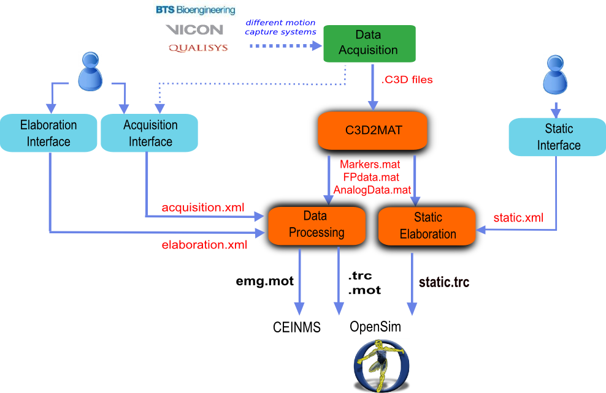

.. _`architecture`:

Getting Started
===============

This section introduces MOtoNMS architecture and how to setup the software on your computer.

Architecture Overview
---------------------

MOtoNMS separates data processing from configuration of the execution. This guarantees high configurability, flexibility, and a user friendly toolbox not requiring a deep confidence with MATLAB for its use.

MOtoNMS has three main *processing steps* (:num:`Fig. #overview`- orange boxes): (1) :ref:`C3D2MAT <C3D2MAT>`, (2) :ref:`Data Processing <DataProcessing>`, and (3) :ref:`Static Elaboration <StaticElaboration>`. Briefly, the objectives of each blocks are:

+ :ref:`C3D2MAT <C3D2MAT>`: retrieves data from the C3D input files and store them in organized MATLAB structures;
+ :ref:`Data Processing <DataProcessing>`: works on dynamic trials processing markers trajectories, ground reaction forces, and EMG signals and produces OpenSim files (``.trc`` and ``.mot`` format);
+ :ref:`Static Elaboration <StaticElaboration>`: processes static trials, computes joint centers, and stores markers trajectories in the corresponding ``.trc`` file.

MOtoNMS configuration goes through user-friendly MATLAB interfaces (:num:`Fig. #overview`- blue boxes), that create the following three XML configuration files with the input parameters for the processing steps (:num:`Fig. #overview`):

+ ``acquisition.xml`` created by :ref:`Acquisition Interface <AcquisitionInterface>`. Each data set must include an ``acquisition.xml`` file. It gathers all information describing the acquisition session such as the number of force plates, coordinate system orientations, marker sets, and EMG setups (see :ref:`Acquisition Interface <AcquisitionInterface>` for details).

+ ``elaboration.xml`` created by :ref:`Elaboration Interface: configure your elaboration <ElaborationInterfaceConfig>`. This XML file includes all the parameters that define the data processing. Examples of these parameters are the identifiers of the trials to be processed, the cutoff frequencies for filtering the different input data, the list of markers to be written in the ``.trc`` files, and the method for  gait event detection (see :ref:`Elaboration Interface: configure your elaboration <ElaborationInterfaceConfig>` for details).

+ ``static.xml`` created by :ref:`Static Interface: configure your elaboration <StaticInterfaceConfig>`. This XML file defines the parameters for the static elaboration part (see :ref:`Static Interface: configure your elaboration <StaticInterfaceConfig>` for details).

All the files are encoded using the XML language. We have chosen this language for its suitability in encoding information. While XML files are easily readable but their editing might be complex, therefore MOtoNMS provides user-friendly MATLAB interfaces that creates these configuration files according to the proper semantic. Indeed, XML files must respect the syntax of a grammar defined in XML Schema (XSD) files (see :ref:`Appendix B: Validation of Setup and Configuration Files <AppendixB>` for details on XML files validation).

.. _overview:

   MOtoNMS overview schema

Supported Applications: OpenSim and CEINMS
------------------------------------------

MOtoNMS has been design to support different output file formats and several musculoskeletal applications. Current version of MOtoNMS already supports OpenSim (`<https://simtk.org/home/opensim>`_) and CEINMS (`<https://simtk.org/home/ceinms>`_).

MOtoNMS processes data collected with different gait instrumentations and produces input files for OpenSim (``.trc`` and ``.mot``, standard OpenSim file formats). When available, EMG signals are also processed and can be exported in several formats (``.mot``, OpenSim motion, ``.sto``, OpenSim Storage, and ``.txt``, plain text format) compatible with the CEINMS toolbox (`<https://simtk.org/home/ceinms>`_) and easily usable also by other applications.

.. _`installation`:

Installation
------------

Download
~~~~~~~~

MOtoNMS is released under the GNU General Public Licence v.3or any later version. An archive of the latest release is available at the project webpage at the `SimTk.org <https://simtk.org/xml/index.xml>`_ website (`<https://simtk.org/home/motonms/>`_). We also provided a set of dataset to play with. If you are interested in collaborate with the development,the software repository is available in GitHub: `<https://github.com/RehabEngGroup/MOtoNMS>`_.

Requirements
~~~~~~~~~~~~

MOtoNMS is implemented in MATLAB and runs on the major operating systems (Windows, Linux, MacOS X). It works with MATLAB R2009a and later versions.

MOtoNMS requires one of the following software for the :ref:`C3D2MAT <C3D2MAT>` part:

+ C3Dserver (`<http://www.c3dserver.com/>`_), which works only with MATLAB 32bitand in Windows.
+ Biomechanical Toolkit (BTK, `<https://code.google.com/p/b-tk/>`_). You can download the BTK version for your system from the BTK project site: `<https://code.google.com/p/b-tk/wiki/MatlabBinaries>`_.

You also need to add the correct BTK folder to the path of MATLAB. Type the command ``help btk`` in the MATLAB's command window to verify that BTK is loaded in MATLAB. You should see the main documentation for the BTK toolbox. If this is not the case, check the path that you added to the list of the directories loaded by MATLAB to register the BTK toolbox.

You can choose to install either `C3Dserver <http://www.c3dserver.com/>`_ or `BTK <https://code.google.com/p/b-tk/>`_. According to your choice, you must use the corresponding :ref:`C3D2MAT <C3D2MAT>` implementation, with C3Dserver (``C3D2MAT_c3dserver``) or with BTK (``C3D2MAT_btk``).

Laboratory requirements:

+ Data collected with a motion capture and force plate system must be labeled and then exported as a C3D file, which is the input format for MOtoNMS. Markers labels MUST not include spaces (e.g. 'LLM' and not 'L LM') and duplicates of marker labels are NOT acceptable in the same markerset.
