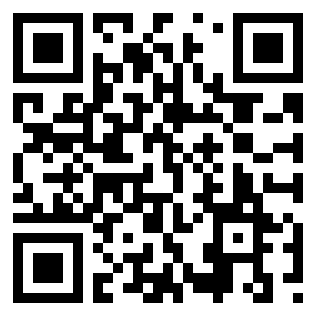

Redistribution: Terms and Conditions
====================================

Copyright 2012-2014 A. Mantoan, M. Reggiani

MOtoNMS is free software: you can distributed it and/or modify it
under the terms of the GNU General Public License as published by the
Free Software Foundation, either version 3 of the License, or (at your
option) any later version. MOtoNMS is distributed in the hope that it will be useful, but WITHOUT
ANY WARRANTY; without even the implied warranty of MERCHANTABILITY or
FITNESS FOR A PARTICULAR PURPOSE. See the GNU General Public License
for more details. You should have received a copy of the GNU General Public License
along with MOtoNMS. If not see `the GNU homepage <http://www.gnu.org/licenses/>`_.

The present user manual is under license cc by-sa, meaning Attribution
Share Alike. You can visit `the creative commons page <http://creativecommons.org/licenses/>`_ to get more
information.

The latest version of this manual is provided in the GitHub Project Pages: `<http://rehabenggroup.github.io/MOtoNMS/>`_.

When using MOtoNMS please acknowledge the authors and cite the
following paper:

| A. Mantoan, C. Pizzolato, M. Sartori, Z. Sawacha, C. Cobelli, and M. Reggiani.
| MOtoNMS: A MATLAB toolbox to process motion data for neuromusculoskeletal modeling and simulation.	
| `Source Code for Biology and Medicine`, 10:12, November 2015.	
| DOI: 10.1186/s13029-015-0044-4	
| URL: `<http://www.scfbm.org/content/10/1/12>`_
